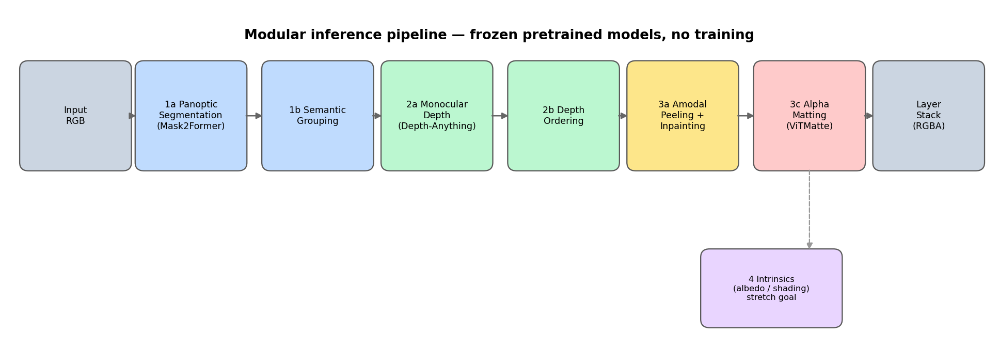
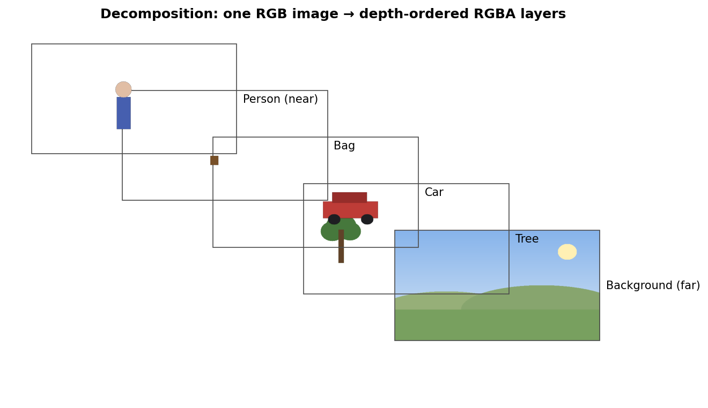
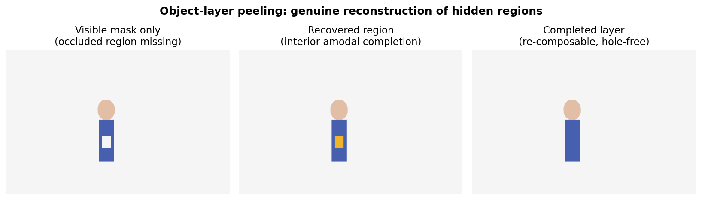
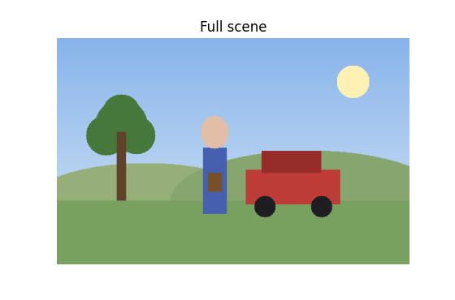

# Layered Representations from a Single Image
### A Modular Pipeline of Frozen Pretrained Models

Turn **one ordinary RGB image** into a **stack of depth-ordered, semantically labelled RGBA layers** that can be pulled apart, edited, re-lit, and re-composed, all using pretrained models.



---

## Table of Contents
1. [What is layered representation of images](#1-what-is-layered-representation-of-images)
2. [Why layered representations matter](#2-why-layered-representations-matter)
3. [The result at a glance](#3-the-result-at-a-glance)
4. [How it works, stage by stage](#4-how-it-works-stage-by-stage)
5. [The hard part: amodal peeling](#5-the-hard-part-amodal-peeling)
6. [Parallax: the payoff of complete layers](#6-parallax-the-payoff-of-complete-layers)
7. [Installation](#7-installation)
8. [Quickstart](#8-quickstart)
9. [Configuration & ablations](#9-configuration--ablations)
10. [Pretrained models used](#10-pretrained-models-used)
11. [Datasets](#11-datasets)
12. [Evaluation](#12-evaluation)
13. [Outputs](#13-outputs)
14. [Repository layout](#14-repository-layout)
15. [Limitations & future work](#15-limitations--future-work)

---

## 1. What is layered representation of images

Given a **single bitmap RGB image**, the pipeline produces a **layered representation** that separates the scene into interpretable, re-composable layers. For every input image the system outputs a stack of RGBA layers with:

- **(a) Semantic grouping:** pixels are grouped into meaningful entities (people, animals, vehicles, furniture, background *stuff*).
- **(b) Depth order:** layers are sorted near → far so they can be composited back correctly and slid apart for parallax.
- **(c) Intrinsic appearance split:** each layer can be decomposed into **albedo** (base color) and **shading** (illumination) for relighting.

The defining design choice is that it is a **modular pipeline of frozen, pretrained models**, where every stage is an off-the-shelf pretrained model wired together with classical geometry and compositing. This makes the system transparent, debuggable, and swappable: each stage can be replaced with an alternative backend via a single config flag.

---

## 2. Why layered representations matter

A flat image collapses a 3D scene into a single grid of pixels, discarding *what* is in the scene and *how far away* each thing is. Recovering an explicit layer stack unlocks a range of downstream applications:

- **Editing:** delete, move, or recolor an object and the scene behind it is already reconstructed.
- **Animation (parallax):** shift layers at depth-dependent rates to fake camera motion from a still image.
- **Relighting:** with the albedo/shading split, change the lighting of individual layers.
- **Downstream vision:** the layer stack is a compact, structured scene description usable by other models.

---

## 3. The result at a glance

The pipeline takes a single flat image (left) and explodes it into an ordered stack of complete RGBA layers (right):

**Input: one flat RGB image**


<br>

**Output: depth-ordered, semantically labelled RGBA layers**



<br>

Each layer carries its **semantic class**, its **group**, and a **relative depth**, recorded in `stack.json`. Composited back in order, the layers reproduce the original image exactly; pulled apart, each is a standalone, hole-free sprite.

---

## 4. How it works, stage by stage

The pipeline is orchestrated by `src/lir/pipeline.py`, which reads a config and runs each stage in turn. Every stage is a small, independent module.

| # | Stage | Module | What it does | Default model |
|---|---|---|---|---|
| 1a | **Panoptic segmentation** | `segmentation.py` | Split the image into instance + stuff masks | Mask2Former (COCO-panoptic) |
| 1b | **Semantic grouping** | `grouping.py` | Map fine COCO classes → coarse groups (people / animals / vehicles / furniture / background) | lookup table |
| 2a | **Monocular depth** | `depth.py` | Predict a per-pixel relative depth map | Depth Anything V2 |
| 2b | **Depth ordering** | `ordering.py` | Assign one robust depth per layer (median over an eroded mask) and sort near → far | (none) |
| 3a | **Amodal peeling** | `peeling.py` + `amodal.py` | Reconstruct each object's hidden (occluded) region so the layer is complete | interior completion (+ pix2gestalt hook) |
| 3b | **Inpainting** | `inpainting.py` | Fill disoccluded holes (behind foreground) and recovered object regions | Stable Diffusion 2 Inpainting |
| 3c | **Alpha matting** | `matting.py` | Refine each layer's alpha for soft, clean edges | ViTMatte |
| (none) | **Recomposition** | `compositing.py` | Composite layers back (Porter-Duff "over") to verify fidelity | (none) |
| 4 | **Intrinsics** *(stretch)* | `intrinsics.py` | Split each layer into albedo + shading | Careaga-Aksoy ordinal shading (external) |

**Design principle** Because each stage is isolated behind a config, running an ablation (say, Marigold depth instead of Depth Anything, or LaMa inpainting instead of SD-2) is a one-line change and requires no code edits.

---

## 5. The hard part: amodal peeling

The most technically interesting stage is **peeling**. A naive pipeline sets each object layer's transparency to its *visible* silhouette, so the moment you slide that object aside, any region that was hidden behind a nearer object is simply **missing**. The layers are not truly re-composable.

This project reconstructs those hidden regions. For each object, processed near → far, the pixels occluded by nearer layers are identified, their appearance is regenerated, and, crucially, they are **kept in the layer's alpha channel** (and carried through matting, which would otherwise collapse the alpha back to the visible mask).



*Left:* the visible mask has a hole where a nearer object (a bag) crossed the torso. *Middle:* the enclosed occluded region is detected (orange) purely from the object's own silhouette geometry. *Right:* the completed, hole-free, re-composable layer.

**Two backends, matching what is honestly recoverable:**

- **`interior` (default, no extra weights).** Recovers occlusion that is *enclosed* by the object's own outline, such as a strap, a held object, or a railing crossing a body. These pixels provably belong to the object (they lie inside its filled silhouette) so they can be reclaimed with confidence. This backend is conservative by design: it never invents extent the image does not support.
- **`pix2gestalt` (optional, external install).** A diffusion amodal-completion model that hallucinates the object's *entire* shape and appearance, including **boundary** occlusion (e.g. legs cut off behind a car). Enable it in the config once the [pix2gestalt](https://github.com/cvlab-columbia/pix2gestalt) repo is installed.

The **background layer** is always completed: every hole left behind the foreground is inpainted and the layer is made fully opaque, so it stands alone as a clean backdrop.

---

## 6. Parallax: the payoff of complete layers

Because the layers are complete, they can be shifted independently at depth-scaled rates to synthesise camera motion from a single still, where near layers move more and far layers move less:


The peeling sequence below shows the layers being removed front-to-back; notice the scene *behind* each removed object is already reconstructed:



Generate your own with `scripts/make_parallax.py` (see Quickstart).

---

## 7. Installation

```bash
git clone https://github.com/HiveCase/layered-representation-of-images.git
cd layered-representation-of-images
pip install -r requirements.txt
```

**Requirements & notes**
- Python 3.10+ recommended.
- A **GPU with ≥ 8 GB VRAM** is recommended. CPU works but is slow.
- The **first run downloads ~6 GB** of model weights from Hugging Face; they are cached afterwards.
- The optional `pix2gestalt` and `intrinsics` backends require cloning their external repos; see the module docstrings.

---

## 8. Quickstart

**Decompose a single image into layers:**
```bash
python scripts/run_single.py \
    --image path/to/img.jpg \
    --out out/demo \
    --config configs/default.yaml
```

**Render a parallax animation from the layers:**
```bash
python scripts/make_parallax.py --layers out/demo --out out/demo/parallax.mp4
```

**Run the evaluation benchmark over a folder of images:**
```bash
python eval/run_benchmark.py \
    --config configs/default.yaml \
    --images data/test_images \
    --out out/bench \
    [--depth-gt data/diode]   # optional: scores depth-ordering accuracy
    [--seg-gt data/seg_masks] # optional: scores instance mask mIoU
```

---

## 9. Configuration & ablations

Everything is driven by `configs/default.yaml`. Swap any stage's backend with an override file, with no code changes:

```bash
# Marigold depth instead of Depth Anything V2
python scripts/run_single.py --image img.jpg --out out/marigold \
    --config configs/default.yaml --override configs/ablations/depth_marigold.yaml
```

Key knobs:

| Section | Flag | Effect |
|---|---|---|
| `segmentation` | `backend`, `score_threshold`, `min_mask_area` | swap segmenter; drop low-confidence / tiny masks |
| `depth` | `backend`, `model_id` | Depth Anything V2 ↔ Marigold |
| `ordering` | `statistic`, `erode_px` | median vs mean depth; erosion to avoid edge bleed |
| `inpainting` | `backend`, `steps`, `guidance`, `dilate_hole_px` | SD-2 ↔ LaMa; quality/speed trade-offs |
| `amodal` | `enabled`, `backend` | `interior` ↔ `pix2gestalt` object completion |
| `matting` | `enabled`, `trimap_erode_px`, `trimap_dilate_px` | alpha refinement |
| `intrinsics` | `enabled` | turn on the albedo/shading stretch stage |
| `output` | `max_layers` | keep N nearest object layers; rest merge into background |

---

## 10. Pretrained models used

**Every stage uses a pretrained model, and no weights are bundled with the repo.** All weights download from Hugging Face or external repos on first use. This is a pure inference pipeline of pretrained experts.

| Role | Model | Source | Status |
|---|---|---|---|
| Panoptic segmentation | `facebook/mask2former-swin-large-coco-panoptic` | Hugging Face | default |
| Monocular depth | `depth-anything/Depth-Anything-V2-Base-hf` | Hugging Face | default |
| Inpainting | `stabilityai/stable-diffusion-2-inpainting` | Hugging Face | default |
| Alpha matting | `hustvl/vitmatte-small-composition-1k` | Hugging Face | default |
| Depth (ablation) | `prs-eth/marigold-depth-lcm-v1-0` | Hugging Face | optional |
| Inpainting (ablation) | LaMa | [advimman/lama](https://github.com/advimman/lama) | hook (not wired) |
| Segmentation (ablation) | SAM 2 + Grounding-DINO | facebookresearch / IDEA-Research | hook (not wired) |
| Amodal completion | pix2gestalt | [cvlab-columbia/pix2gestalt](https://github.com/cvlab-columbia/pix2gestalt) | optional backend |
| Intrinsics (stretch) | Careaga-Aksoy ordinal shading | [compphoto/Intrinsic](https://github.com/compphoto/Intrinsic) | optional |
| Perceptual metric | LPIPS (AlexNet) | `lpips` package | eval only |

---

## 11. Datasets

**You supply your own images; no dataset ships with the repo.** Because pretrained models are used throughout, datasets appear only as *evaluation inputs*. See [`data/README.md`](data/README.md) for the exact folder layout. In brief:

- **`test_images/`:** your frozen evaluation images (any style: photoreal, anime, vector).
- **`nyuv2/` or `diode/`:** depth ground truth, used *only* to score depth-ordering accuracy.
- **`seg_masks/`:** optional per-image instance masks, used to score segmentation mIoU.
- **`failures/`:** your own gallery of hard/failed cases for the limitations analysis.

---

## 12. Evaluation

`eval/run_benchmark.py` runs the pipeline over a folder and reports:

- **Recomposition fidelity:** PSNR, SSIM, LPIPS between the original and the layers re-composited back together (always computed).
- **Partition integrity:** a ground-truth-free check that the visible layers *tile* the image (fraction of pixels claimed exactly once / overlapped / unclaimed).
- **Depth-ordering accuracy:** with `--depth-gt`, the fraction of layer pairs whose predicted near/far order matches the GT depth map (deliverable **b**).
- **Instance mIoU:** with `--seg-gt`, greedy-matched mask IoU against GT instances (deliverable **a**).

Metric definitions live in `eval/metrics.py`.

---

## 13. Outputs

For an input processed to `out/<name>/`:

```
out/<name>/
├── layer_00.png … layer_NN.png   # RGBA layers, near → far
├── stack.json                    # per-layer class, group, depth, area
├── recomposed.png                # layers composited back (fidelity check)
└── (debug visualizations if --save-debug)
```

---

## 14. Repository layout

```
layered-representation-of-images/
├── configs/
│   ├── default.yaml              # single source of truth for all stages
│   └── ablations/                # one-flag backend swaps
├── src/lir/
│   ├── pipeline.py               # orchestrator
│   ├── types.py                  # Layer / LayerStack data structures
│   ├── segmentation.py           # 1a
│   ├── grouping.py               # 1b
│   ├── depth.py                  # 2a
│   ├── ordering.py               # 2b
│   ├── peeling.py                # 3a  (amodal-aware)
│   ├── amodal.py                 # 3a  object completion (interior / pix2gestalt)
│   ├── inpainting.py             # 3b
│   ├── matting.py                # 3c
│   ├── compositing.py            # recomposition
│   └── intrinsics.py             # 4   (stretch)
├── scripts/
│   ├── run_single.py             # decompose one image
│   └── make_parallax.py          # parallax video from layers
├── eval/
│   ├── metrics.py                # all metric definitions
│   └── run_benchmark.py          # batch evaluation
├── data/
│   └── README.md                 # dataset sourcing + folder layout (you populate the rest)
├── assets/                       # figures and animations used in this README
├── requirements.txt
├── LICENSE
└── README.md
```

---

## 15. Limitations & future work

- **Boundary amodal completion** requires the optional `pix2gestalt` backend; the default `interior` backend recovers only occlusion enclosed by an object's own silhouette (by design, so it never fabricates unsupported extent).
- **Depth is relative, not metric.** Ordering relies on a robust per-layer statistic; very thin or transparent objects can be mis-ordered.
- **Segmentation drives everything.** Missed or merged instances propagate downstream; tune `score_threshold` / `min_mask_area` per domain.
- **Inpainting can hallucinate** texture in large disoccluded regions; LaMa may be preferable for structured backgrounds.
- **Intrinsics is a stretch stage** and is off by default.
